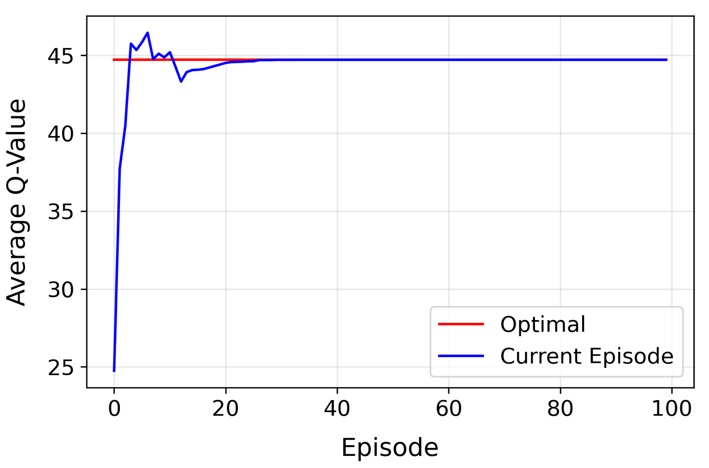
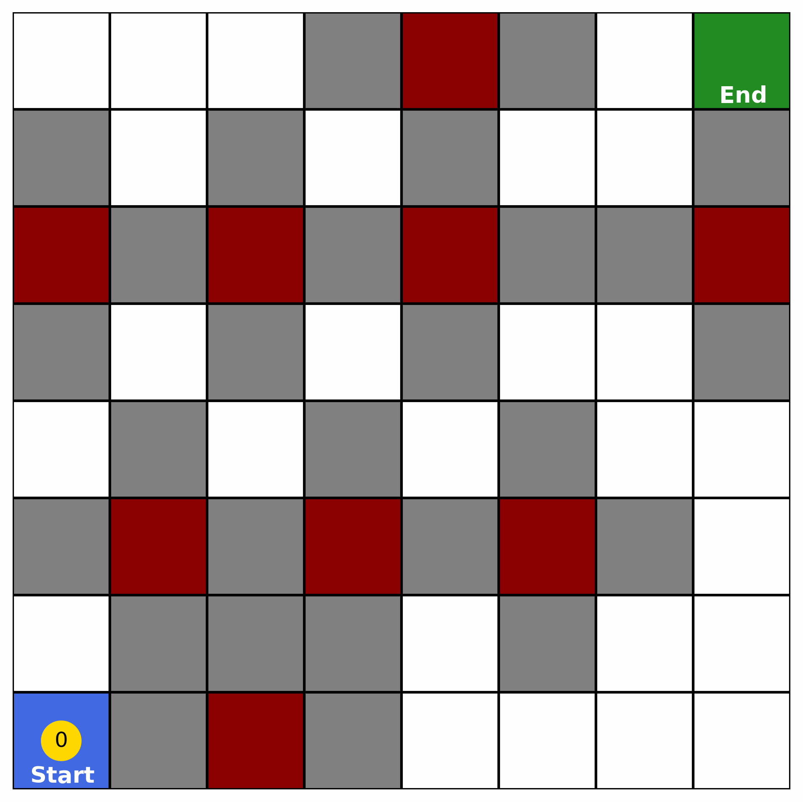
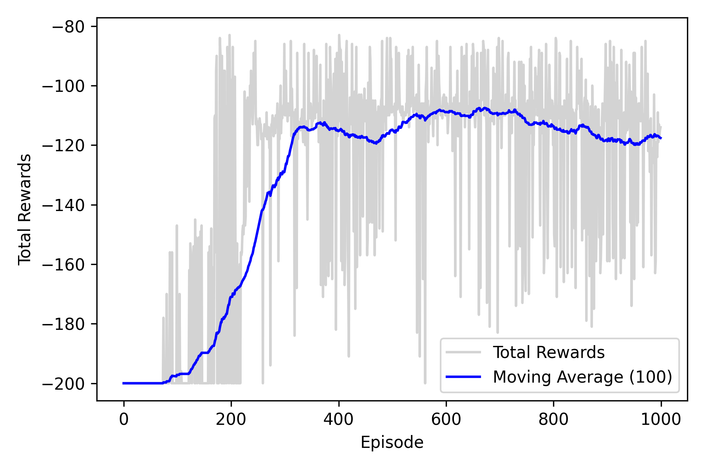
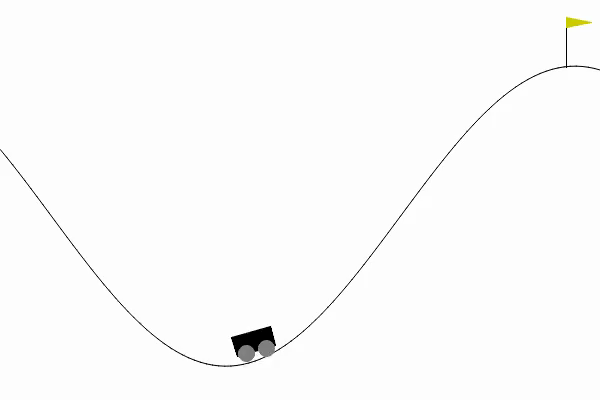
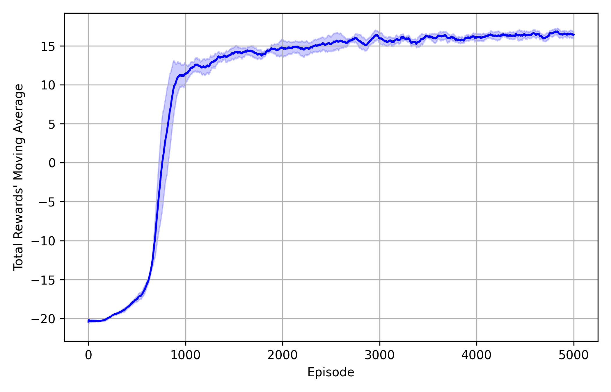
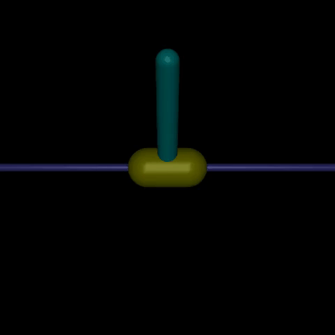

# Sequential Decision-Making Optimization

This repository provides the codes for some of the examples given in the "Sequential Decision-Making Optimization" chapter within the Book "[Creative Artificial Intelligence for Discovery Automation](https://www.cai4discovery.com)" written by Danial Khorasanian. 

There are three main sections:
- Dynamic Programming,
- Monte Carlo Control, and
- Reinforcement Learning.

## Reinforcement Learning
RL methods and the problems solved with each include:
- Q-learning: Maze
- DQN
    - Car
    - Pong
- Reinforce: [Inverted Pendulum](environments/inverted_pendulum/experiments.ipynb)
- Advantage Actor-Critic (A2C): [Inverted Pendulum](environments/inverted_pendulum/experiments.ipynb)
- Proximal Policy Optimization (PPO): [Inverted Pendulum](environments/inverted_pendulum/experiments.ipynb)

## Training Results

<table border="0" width="100%">
  <tr>
    <td width="20%" align="center">
      Maze (Q-learning)
    </td>
    <td width="2.5%" align="center">
      &nbsp;
    </td>
    <td width="35%" align="center">
      
    </td>
    <td width="2.5%" align="center">
      &nbsp;
    </td>
    <td width="30%" align="center">
      
    </td>
  </tr>

  <tr>
    <td align="center">
      Car (DQN)
    </td>
    <td align="center">
      &nbsp;
    </td>
    <td align="center">
      
    </td>
    <td align="center">
      &nbsp;
    </td>
    <td align="center">
      
    </td>
  </tr>

  <tr>
    <td align="center">
      Pong (DQN)
    </td>
    <td align="center">
      &nbsp;
    </td>
    <td align="center">
      
    </td>
    <td align="center">
      &nbsp;
    </td>
    <td align="center">
      
    </td>
  </tr>

  <tr>
    <td align="center">
      Inverted Pendulum (REINFORCE, A2C, PPO)
    </td>
    <td align="center">
      &nbsp;
    </td>
    <td align="center">
      
    </td>
    <td align="center">
      &nbsp;
    </td>
    <td align="center">
      
    </td>
  </tr>
</table>